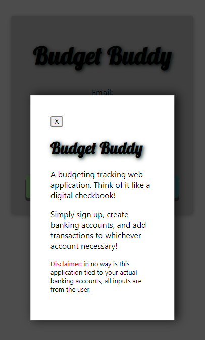
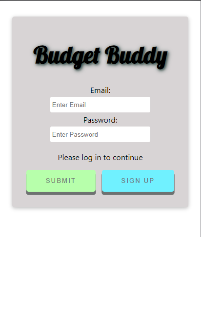
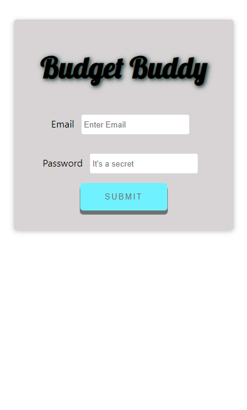
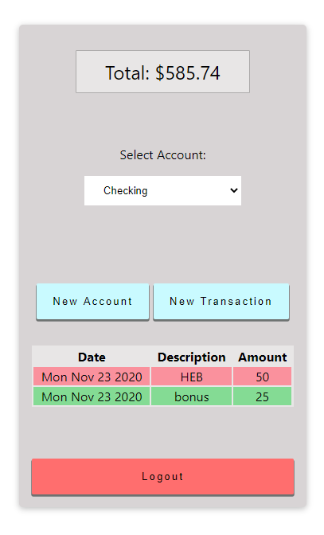
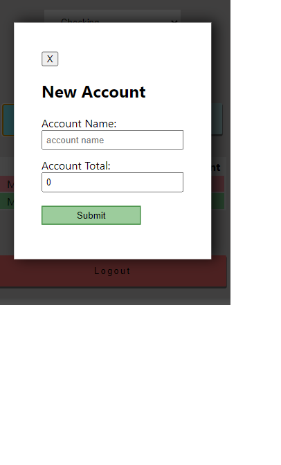
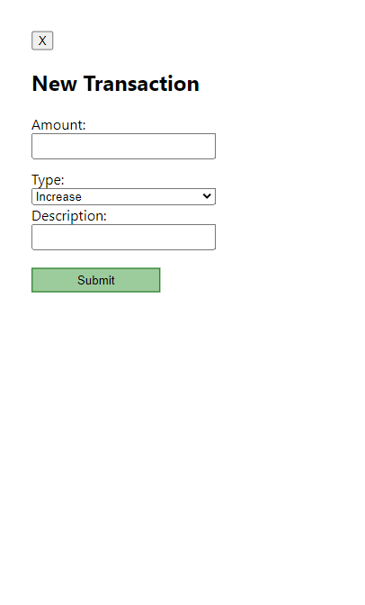

# Budget Buddy Client

**[Budget Buddy](https://budget-buddy.vercel.app/)**

**Summary**

This application was built for budgeting and financing tracking purposes. The idea was to eliminate the hidden "processing delay" from your banking applications, by enabling the user to fully control their financing.

This application was built using React, Node, PostgreSQL, and Express.

